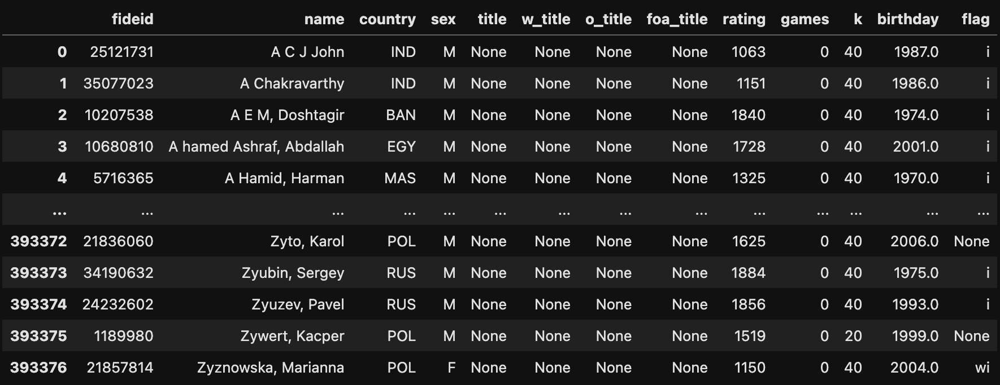

# Chess - Popularity
The world of chess has experienced an increase in popularity in recent years. 
Since the broadcast of the "Queen's Gambit" series on Netflix, this ancient game has been gaining momentum online, a momentum that received an even greater boost during the COVID-19 pandemic when many remained locked in their homes and sought activities to engage with online. 
Chess provides a perfect solution as it can be played online with people from all over the world, offering an escape from the monotony of lock-down and providing a mental challenge to players. 
Additionally, the rise of online streaming platforms such as Twitch has made it possible for professional chess players to stream their games and provide commentary, further increasing the visibility of the game and inspiring a new generation of chess enthusiasts. 
As a result, the popularity of chess continues to grow, with tournaments attracting large audiences and players of all skill levels coming together to enjoy this timeless game. 
According to a [report](about:black) by the site chess.com, the world's largest site for online chess, the number of active users on the site reached 100 million users, an 238% increase from what it had two and a half years ago.
Anyone interested in the field notices quite quickly the prominent presence of top players of Russian origin. 
In fact, for almost 60 years, starting from the 1940s, with the raise of  Mikhail Botvinnik, until the beginning of the 2000s at the end of Garry Kasparov's regime, the title of world champion was held only by players of Russian (or Soviet Union) origin, with the exception of a small break in the form of the phenomenal figure of the American Bobby Fisher.
Since the beginning of the 2000s, the title has migrated to different countries such as Ukraine and Norway, but still at the top you can find many players from the red country. 
Names like Ian Nepominachi, Sergey Kryakin, Danil Dubov and Alexander Grishchuk populate the most prestigious tournaments and produce a Russian-made team that is very hard to match. 
All this without mentioning the fact that also in other countries, such as the United States, you can find many [Russian](danya)-[speaking](gotham) [players](who-else).
All these led to the perception that the world chess capital is Russia. 
Many speculations have been made over the years regarding the reason and Russian education is [often](source) [mentioned](source) as one of the main factors that make up the great popularity of the game of kings in Russia.

Another country that has made headlines in recent years in the world of chess is India. 
A country that was not considered a prominent source of great chess players over the years, has been producing more and more excellent players in recent years.
Starting with Anand, the world champion for the year 2007-2012, and up to the younger generation in the form of such as Gukesh, Sarin, Erigaisi and more.
India is emerging as a rising power in the world of chess and [many](source) [articles](source2) have been written in an attempt to characterize the roots of this dramatic rise.

But, I want to be a little annoying and challenge these two perceptions. 
To that end, let's take a look at some data.

Before that, two small clarifications:
1. The data I use is the full FIDE table of players. The data in this database includes national affiliation only and is not divided into regions within countries. I understand that there is logic in testing at a higher resolution and that certain cities or certain regions of the country can stand out in such an analysis and give a more accurate picture. I don't have this data, so I'll be content, for the sake of exercise and curiosity, with what is available.
2. Different claims can be made regarding the non-official popularity of chess in different countries (sources) but I have no data or idea how to find such data. That's why I rely again on what is available, which is the list of all the players registered in FIDE. If anyone has other ideas I would love to hear them.
3. I am using data from a few months ago for the simple reason that since the outbreak of the war in Ukraine, FIDE has imposed a boycott on Russia and for that reason many players are not registered as Russian but as stateless (and play under the FIDE flag).

## the data
In FIDE registered, as of August 2022, 393377 players. 
The full FIDE player list looks like this


### Making the data usable

One of the main obsitcles of using this table is that FIDE uses non-conventional country codes and also includes a huge list of federations (did you know that Jersey, an Island between England and France with 100K, has its own federation? Shout out to Love Robs).

This is a problem because most of population data (which we will be using later) uses more standard list of countries. So we had to merge those provincies (sorry Jersey).

```python
nieche_countries_dict = {
    'Bosnia & Herzegovina' : 'Bosnia and Herzegovina',
    'England' : 'United Kingdom',
    'Wales' : 'United Kingdom',
    'Jersey' : 'United Kingdom',
    'Scotland' : 'United Kingdom',
    'Antigua & Barbuda' : 'Antigua and Barbuda',
     'Chinese Taipei' : 'China',
     'US Virgin Islands' : 'U.S. Virgin Islands',
     'Netherlands Antilles' : 'Netherlands',
     'St. Vincent and the Grenadines' : 'Saint Vincent and the Grenadines',
     'FYR Macedonia' : 'Macedonia',
     'Trinidad & Tobago' : 'Trinidad and Tobago',
     'Democratic Republic of Congo' : 'Zimbabwe',
     "Côte d'Ivoire" : 'Ivory Coast',
     'Guernsey' : 'United Kingdom',
}

def fix_some_countries(name):
    new_name = name
    if name in nieche_countries_dict.keys():
        new_name = nieche_countries_dict[name]
    return new_name
    
fide['country name'] = fide['country name'].apply(fix_some_countries)
```

### Back to the Analysis

The first thing we want to check is how many players there are in each country.

```python
fide['country name'].value_counts().head(10)
```

Which yields

| Country        | Players |
| -------------- | ------- |
| Russia         | 38340   |
| India          | 36308   |
| Germany        | 28653   |
| Spain          | 28387   |
| France         | 26840   |
| Iran           | 12315   |
| Poland         | 12243   |
| Italy          | 11970   |
| Turkey         | 9553    |
| Czech Republic | 8658    |

Unsurprisingly, Russia is at the top and India in second place.
For those who are wondering, in the last place is Chad where a single player, named Mahamat Hachim Bachar,  is listed.
Another index that is interesting to check is how many Grand-Masters are registered in each country. A quick check yields the following table:

| Country                  | GMs  |
| ------------------------ | ---- |
| Russia                   | 208  |
| United States of America | 106  |
| Germany                  | 97   |
| Ukraine                  | 90   |
| India                    | 76   |
| Spain                    | 57   |
| France                   | 54   |
| Serbia                   | 52   |
| Hungary                  | 51   |
| Poland                   | 50   |

A final measure for now will be how many players with any titles there are in each country. In this way we can examine not only the very top but still concentrate on the professional level of the field.
(Chart)
A final dimension, slightly different but intriguing, is the young players. Let's try to give a glimpse of the next generation of chess by looking at players under a certain age who have already established themselves and crossed a certain ranking threshold. For this purpose, we set the maximum age to—- and the minimum rating to—- and we will accept
(Chart)
And finally we will present the tables in a nice way on a map:
(maps)
As you can see very nicely, Russia is so dominant that it destroys the scale. India is also present here, although still behind. It seems that the concepts we mentioned at the beginning are indeed anchored in the data.
But here I want to point out one small thing that was forgotten in the process - normalization.
on the importance of normalization
  But this analysis overshadows a very important issue in data analysis and presentation: the great importance of data normalization.
Let's take for example the question "Which countries have the most internet surfers?" Probably no one will be surprised by the list. In fact, a quick glance will reveal that the list is suspiciously reminiscent of the list of "the most populated countries in the world". This phenomenon has appeared in many places, although usually in a less exaggerated and noticeable way.
[xkcd's comic about some maps being just population mapshttps://xkcd.com/1138/].
Sweet, this rather trivial insight, let's return to the question of "how many people play chess in each country" Would anyone be surprised that there are more chess players in Russia, a country of about two hundred million people, than in (relatively) small Norway? Well it's obvious, tell me, but there are still more players in Russia than, say, China or the USA!
And it is very true, the coalition here between the number of residents and the number of players in the country is not perfect and not close to it, but it cannot be ignored. As in the comparison between countries, one does not look at the GDP but at the GDP per capita because it is clear that there is almost no meaning in comparing the absolute numbers between countries that differ radically in population size.
So, if you agree with me that the correct measure is not "the number of chess players" but "the number of chess players in relation to the population" the resulting picture is very different and much more interesting.
Let's go back to data. Now we will divide all our data by the number of inhabitants of each country (and multiply by 10000 so that our own scale is more convenient) and we will get the following table:
[Chart]
Well, I'm sorry Iceland, but you are completely distorting the scale, so we will exclude you from the discussion (and any other country smaller than Iceland).
[table without Iceland]
As you can see the picture here is completely different. Suddenly the big countries disappeared and other countries emerged in their place, mainly Eastern European countries but not only. Shout out to Croatian Agdamator for being the most famous representative of Croatian chess (interestedHere is an article about chess in Croatia). Apart from Croatia, the list also stars Spain, known for their strong team (some 2-3 names), Hungary, home of Judith Folger and Richard Rapport, and of course - Norway, whose leading chess player does not need to be expanded (link to Magnus' photo).
Let's zoom out. Here is an illustration of what is happening all over the world
[from here]
You are welcome to scroll up a second and compare to the corresponding map before normalization. As you can see Russia has deteriorated badly not to mention the USA which is placed below almost every European country and even some countries from South America and Asia. In India the story is similar, but we will return to it later. In China, if you were wondering, the most popular board game is Go, so the index there is not very surprising.
Let's quickly make the same correction to our other metrics as well:
[Table of many artists]
[table of women]
[table of child prodigies]
How many points:
Georgia is a women's chess powerhouse. This is not new to anyone who follows the field, but it is worth stopping for a moment and realizing that it is even more unusual than, say, female chess in China in light of the small size of Georgia - (Georgia's size and comparison to the US country)
For a reason that is not clear to me, the number of rabbi artists in Montenegro and Serbia is unusual. Although there is not a single rabbi in these two countries who is ranked above 2700, the senior player is Alexander Fredka and he is currently ranked 49th in the world. Nevertheless, Serbia is a country of less than 7 million people and has over 50 rabbi artists! (Here is a discussion in the case of possible causes of the phenomenon)
If in the general ranking of players Russia has fallen a little lower, in the ranking of many artists its situation is even worse. On the other hand, in women's chess, she gets back up (but not to the top).
In the USA as of today there is only one female rabbi - the wonderful Irene Crush.
To summarize the discussion, I decided to combine two parameters into one table to also examine the popularity (in the form of the overall number of players) at the same time as the degree of "success" (to be measured for that matter by the number of artists):
[Graph of many artists versus actors]
Finally - India
Chess in India is growing massively, it's no secret (here are 3 different articles). But here the dark side of the nirmol is nicely demonstrated - it prevents more subtle insights about really large groups. India is huge, the number of its inhabitants is equal to that of the USA, Russia, Brazil, Japan and Great Britain together! The problem is that this is a country on a different scale of size. Some would argue that a more correct comparison would be to divide India (and perhaps China as well) into provinces in this analysis. Unfortunately, I do not have such information, so we have to be content only with the great chess that the young (and also the old) from India are giving us.


In the next post I will try to continue this discussion but turn the spotlight on a well-known and age-old problem in chess - the gender gap

